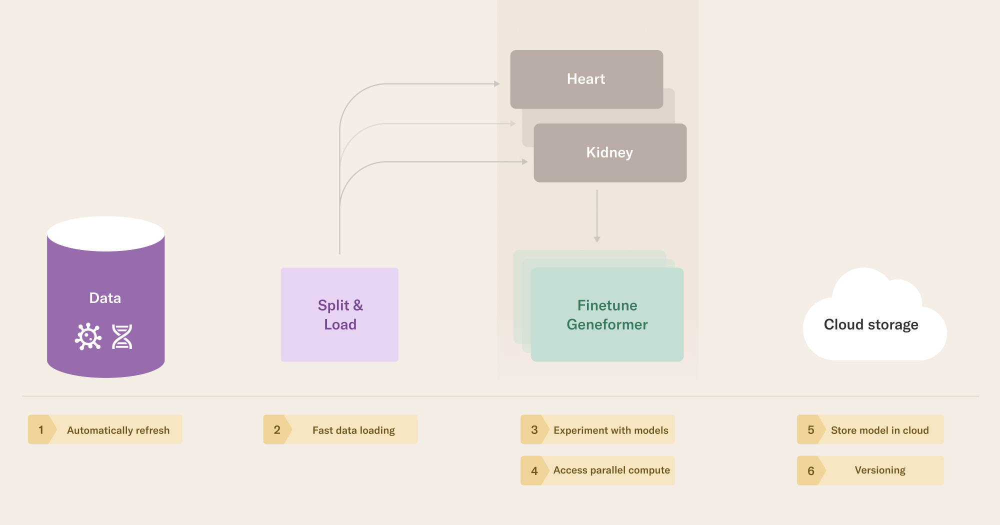

# Instructions

## Download the dataset from HuggingFace
Download the files [here](https://huggingface.co/datasets/ctheodoris/Genecorpus-30M/tree/main/example_input_files/cell_classification/cell_type_annotation/cell_type_train_data.dataset) and put it in the working directory in the `cell_type_train_data.dataset` folder.

The workflow will upload these files and cache them in S3. 

## Setup
```
pip install outerbounds
outerbounds configure <>
```

If you want to make a private version of the Docker image for the fine-tuning step of the workflow, see the `Dockerfile` in the root of this repository. 

```
docker build -t geneformer .
```

## Iterate
You can find hyperparameters to tune in `config.py`. 

### Run the workflow

#### Run the workflow locally
Download Geneformer and install dependencies in the virtual environment where you are running Metaflow
```bash
git clone https://huggingface.co/ctheodoris/Geneformer
cd Geneformer
pip install .
```

Then, run the flow, passing a parameter to the workflow that is used to load the model with HuggingFace:
```bash
python flow.py run --path <PATH/TO/Geneformer>                    # default model
python flow.py run --path <PATH/TO/Geneformer/geneformer-12L-30M> # bigger model
```

#### Run the workflow remotely
```bash 
python flow.py run # by default, try to use geneformer-12L-30M. use --path as before if you change stuff in the docker image
python flow.py run --path /Geneformer # to use the default model.
```
